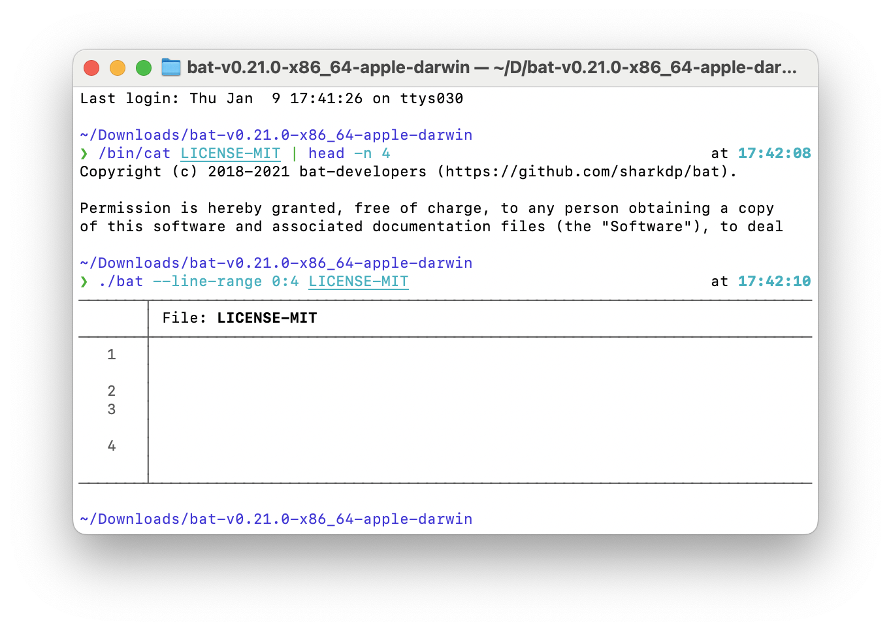
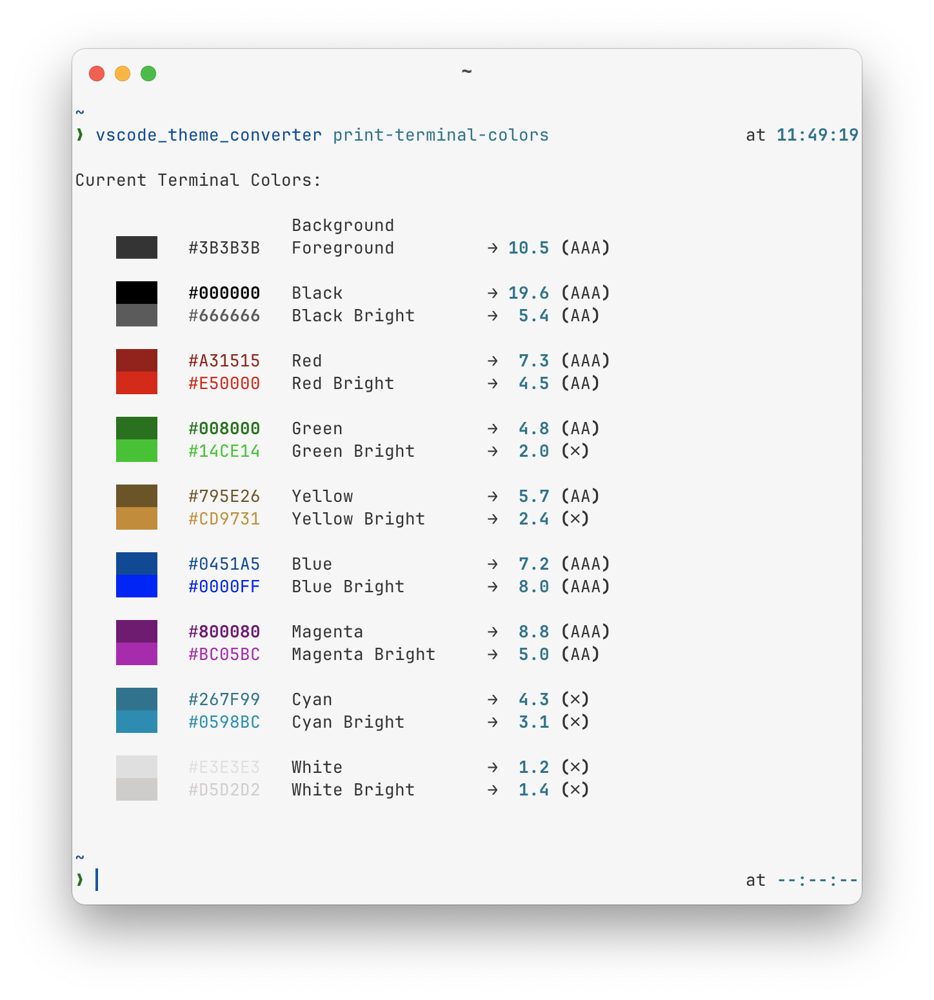
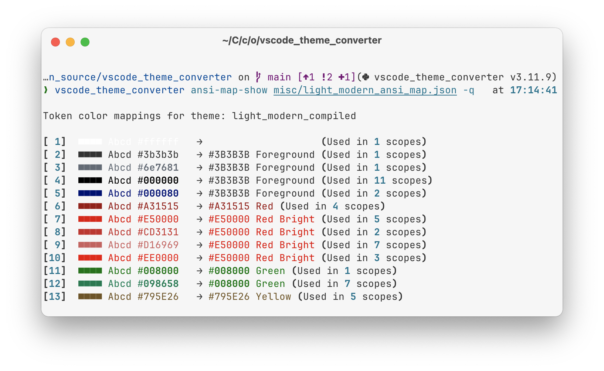

# VSCode Theme Converter

This tool allows you to convert VSCode editor themes to terminal apps, such as `bat`.

It can create themes that look great on both dark and light terminals by mapping the theme colors to ANSI-16 colors.

Take a look at this video where I cycle through multiple Ghostty terminal themes, but use the same `bat` theme:

## Table of Contents

- [1. Why you should consider using ANSI-16 colors in your terminal](#1-why-you-should-consider-using-ansi-16-colors-in-your-terminal)
  - [1.1. What's the problem with RGB colors?](#11-whats-the-problem-with-rgb-colors)
  - [1.2. What are ANSI-16 colors and how do they solve the problem?](#12-what-are-ansi-16-colors-and-how-do-they-solve-the-problem)
- [2. Converted Themes](#2-converted-themes)
  - [2.1. VSCode Light Modern](#21-vscode-light-modern)
- [3. Usage Instructions](#3-usage-instructions)
  - [3.1. Install](#31-install)
  - [3.2. Convert a VSCode Theme to tmTheme (Bat, TextMate, Sublime Text, etc.)](#32-convert-a-vscode-theme-to-tmtheme-bat-textmate-sublime-text-etc)
    - [3.2.1. Generate a "compiled" VSCode theme file](#321-generate-a-compiled-vscode-theme-file)
    - [3.2.2. Convert the theme file](#322-convert-the-theme-file)
  - [3.3. Create an ANSI theme](#33-create-an-ansi-theme)
    - [3.3.1. Inspect your terminal's colors](#331-inspect-your-terminals-colors)
    - [3.3.2. Map your theme's RGB colors to ANSI colors](#332-map-your-themes-rgb-colors-to-ansi-colors)
    - [3.3.3. Generate the ANSI theme file](#333-generate-the-ansi-theme-file)

## 1. Why you should consider using ANSI-16 colors in your terminal

### 1.1. What's the problem with RGB colors?

The best way to answer this question is to demonstrate the problems that can arise when you use RGB colors in your terminal.

This is how the popular `cat` replacement `bat` looked like in the default terminal app on macOS for many years:



Notice how the default `cat` command printed the license text, but `bat` didn't.

Well... In fact,  `bat` did print the text, but the text is not visible because `bat`'s default theme used RGB colors and was optimized for dark terminals.

My goal here is not to bash on `bat`. I love `bat`; it's one of my most used CLI tools.

On top of that, they solved [the issue](https://github.com/sharkdp/bat/issues/1104) years ago in [PR #2197](https://github.com/sharkdp/bat/pull/2197) and added the option to define a light and dark theme in version 0.25.0.

I am just using `bat` to illustrate the inherent problem that can occur when you use RGB colors in your terminal.

The core problem is that **CLI apps can display arbitrary colors, but they usually don't control the background color**.

Themes with RGB colors work well in GUI tools like VSCode because these themes not only define the text colors but also specify the background color.

But in terminal apps, the background is usually decided by the terminal app itself and not the apps running in the terminal.

And this leads not only to stylistic issues, but also to ergonomic issues where text is not readable or doesn't have enough contrast.

### 1.2. What are ANSI-16 colors and how do they solve the problem?

Today, most terminal apps can render over 16 million colors using a "true color" mode. But they also support a set of 16 colors that are called `ANSI colors`.

The 16 colors are:
1. Black
2. Red
3. Green
4. Yellow
5. Blue
6. Magenta
7. Cyan
8. White

Plus a bright version of each of these colors-- making it a total of 16 colors.

Here is a screenshot of the 16 ANSI colors in my terminal:



But what makes the ANSI colors so great is that most terminals allow you to pick the color you want to display for each of these 16 colors. So, if you wanted the color `Blue` to be displayed as pink, you could do that!

This offers you a huge advantage when it comes to theming terminal apps: **It allows you to decouple the _meaning_ of the color from the actual color that will be displayed by the terminal**.

For example, VSCode's light-modern theme displays comments in `green` and strings in `red`.

ANSI colors allow you to preserve the _meaning_ of the color, but at the same time to make sure the rendered color is readable and looks good on any background.

That is, as long as the terminal theme author picked colors that are readable on the background color they chose.

**Another benefit is consistency.** If you configure your terminal tools to use ANSI colors, then the colors will be consistent across all your terminal tools.

## 2. Converted Themes

### 2.1. VSCode Light Modern

I converted the `VSCodeDefault Light Modern` theme and you can find the converted theme files here: [themes/vscode-light-modern](themes/vscode-light-modern).

You will also find matching Ghostty terminal themes for it in the same directory.

If you want another theme, you can follow the instructions below to convert it yourself.

## 3. Usage Instructions

### 3.1. Install

The easiest way to install the tool is to use [pipx](https://pipx.pypa.io/stable/).

```bash
pipx install git+https://github.com/infused-kim/vscode_theme_converter

# You should be able to use the tool now:
vscode_theme_converter --help

# Or if you want to make changes...
git clone git@github.com:infused-kim/vscode_theme_converter.git
cd vscode_theme_converter
pipx install -e .[dev]
```

### 3.2. Convert a VSCode Theme to tmTheme (Bat, TextMate, Sublime Text, etc.)

#### 3.2.1. Generate a "compiled" VSCode theme file

For many themes, you can't just use the `.json` file of the theme because they use `include` statements to reference other themes, such as this:
```jsonc
{
    "$schema": "vscode://schemas/color-theme",
    "name": "Default Light Modern",

    // Includes another theme
    "include": "./light_plus.json",

    // [...]
}
```

Therefore you should instead apply the theme in your VSCode settings and then run the `Developer: Generate Color Theme From Current Settings` command to generate the fully merged theme file.

The theme file will also contain a lot of settings that are commented out. You should remove the comments to make sure they are also converted.

#### 3.2.2. Convert the theme file

Once you have the fully merged theme file, you can convert it to a tmTheme file using the following command:

```bash
vscode_theme_converter convert "vscode-theme-compiled.json" "vscode-theme.tmTheme"
```

### 3.3. Create an ANSI theme

#### 3.3.1. Inspect your terminal's colors

```bash
vscode_theme_converter print-terminal-colors
```

This will print the colors of your terminal to the console. You should then use these colors to create an ANSI theme.

If your terminal supports the xterm protocol, it should also show you the actual color codes your terminal is using. This has been tested on macOS with iTerm2, Ghostty, and the Terminal app.


The contrast value is calculated using the [WCAG 2.1 contrast formula](https://www.w3.org/TR/WCAG21/#dfn-contrast-ratio) and is the same value that Google Chrome shows in the developer tools.

#### 3.3.2. Map your theme's RGB colors to ANSI colors

The next step is to extract all the colors that are being used in your theme and map them to the 16 ANSI colors.

```bash
vscode_theme_converter ansi-map-gen "vscode-theme-compiled.json" "vscode-theme-ansi-map.json"
```

This will generate a JSON file like this:

```json
{
  "theme_name": "light_modern_compiled",
  "color_mappings": [
 {
      "color_code": "#000000",
      "ansi_color": null,
      "scopes": [
        "entity.name.label",
        "keyword.operator",
        "keyword.operator.quantifier.regexp",
        "meta.embedded",
        "meta.template.expression",
        "source.groovy.embedded",
        "storage.modifier.import.java",
        "storage.modifier.package.java",
        "string meta.image.inline.markdown",
        "variable.language.wildcard.java",
        "variable.legacy.builtin.python"
 ]
 },
    // [...]
 ]
}
```

The only field you need to fill in is the `ansi_color`. Everything else is just there to help you understand where the color is being used.

You can use the following values for `ansi_color`:

- `FOREGROUND` (default terminal text color)
- `BLACK`
- `BRIGHT_BLACK`
- `RED`
- `BRIGHT_RED`
- `GREEN`
- `BRIGHT_GREEN`
- `YELLOW`
- `BRIGHT_YELLOW`
- `BLUE`
- `BRIGHT_BLUE`
- `MAGENTA`
- `BRIGHT_MAGENTA`
- `CYAN`
- `BRIGHT_CYAN`
- `WHITE`
- `BRIGHT_WHITE`

Once you have added the mappings to the `JSON` file, you can use the following command to preview the ANSI mapping...

```bash
vscode_theme_converter ansi-map-show "vscode-theme-ansi-map.json"
```



My recommendation is to not map anything to the `black` and `white` colors as they frequently don't work well when switching between light and dark themes.

You can also adjust the theme of your terminal to make the terminal colors match VSCode more closely.

You can use the VSCode command `Developer: Inspect Editor Tokens and Scopes` to show the exact colors VSCode renders for each element.

#### 3.3.3. Generate the ANSI theme file

Once you are happy with the mappings, you can generate the ANSI theme file using the following command:

```bash
vscode_theme_converter convert "vscode-theme-compiled.json" "vscode-theme.tmTheme" --ansi-map "vscode-theme-ansi-map.json"
```

This will generate a tmTheme file that you can use with bat in your terminal.
- [1. Why you should consider using ANSI-16 colors in your terminal](#1-why-you-should-consider-using-ansi-16-colors-in-your-terminal)
  - [1.1. What's the problem with RGB colors?](#11-whats-the-problem-with-rgb-colors)
  - [1.2. What are ANSI-16 colors and how do they solve the problem?](#12-what-are-ansi-16-colors-and-how-do-they-solve-the-problem)
- [2. Converted Themes](#2-converted-themes)
  - [2.1. VSCode Light Modern](#21-vscode-light-modern)
- [3. Usage Instructions](#3-usage-instructions)
  - [3.1. Install](#31-install)
  - [3.2. Convert a VSCode Theme to tmTheme (Bat, TextMate, Sublime Text, etc.)](#32-convert-a-vscode-theme-to-tmtheme-bat-textmate-sublime-text-etc)
    - [3.2.1. Generate a "compiled" VSCode theme file](#321-generate-a-compiled-vscode-theme-file)
    - [3.2.2. Convert the theme file](#322-convert-the-theme-file)
  - [3.3. Create an ANSI theme](#33-create-an-ansi-theme)
    - [3.3.1. Inspect your terminal's colors](#331-inspect-your-terminals-colors)
    - [3.3.2. Map your theme's RGB colors to ANSI colors](#332-map-your-themes-rgb-colors-to-ansi-colors)
    - [3.3.3. Generate the ANSI theme file](#333-generate-the-ansi-theme-file)
